# 📋 Task Manager App

A full-featured task management application built with Flutter, featuring user authentication, task CRUD operations, and a modern, responsive UI. This project was developed as part of an Ostad assignment to demonstrate real-world full-stack development skills.

[](https://flutter.dev/)
[](https://dart.dev/)
[](https://choosealicense.com/licenses/mit/)

## 📱 Screenshots

<table>
  <tr>
    <td align="center"><strong>Authentication Flow</strong></td>
    <td align="center"><strong>Task Management</strong></td>
    <td align="center"><strong>Status Updates</strong></td>
  </tr>
  <tr>
    <td>
      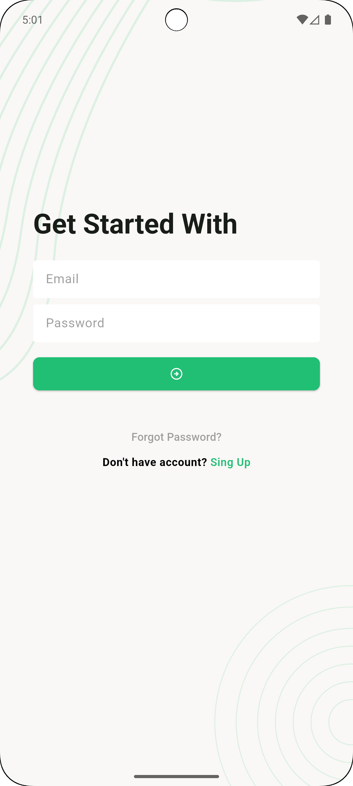<br/>
      <em>Login Screen</em>
    </td>
    <td>
      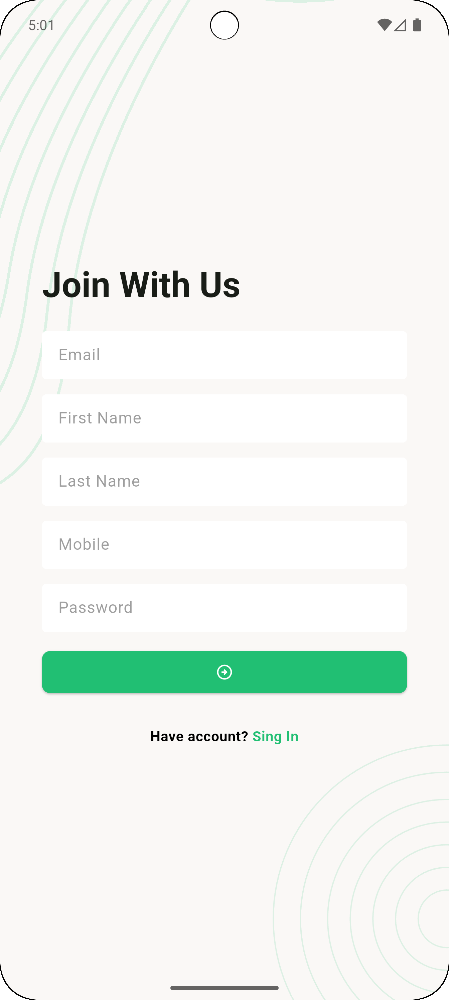<br/>
      <em>Sign Up Screen</em>
    </td>
    <td>
      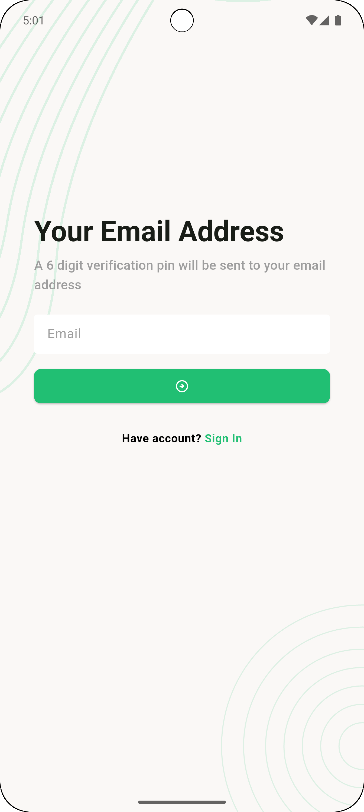<br/>
      <em>Email Verification</em>
    </td>
  </tr>
  <tr>
    <td>
      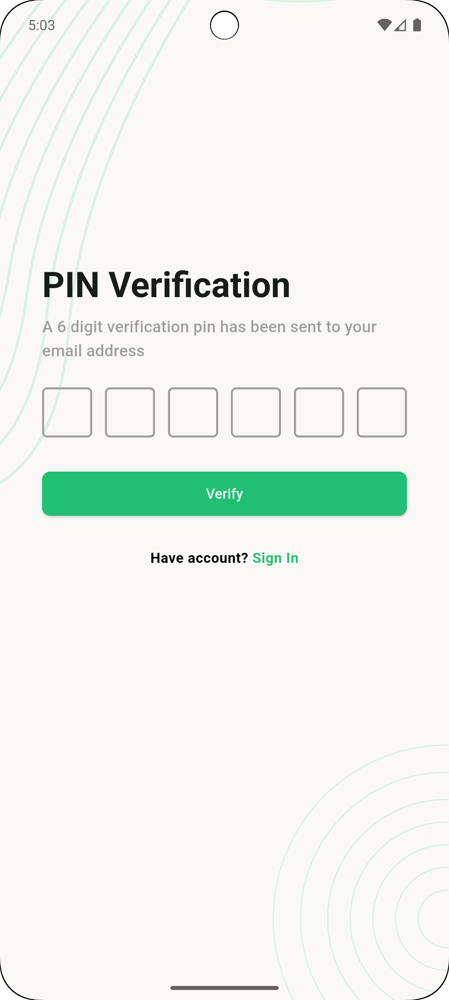<br/>
      <em>PIN Verification</em>
    </td>
    <td>
      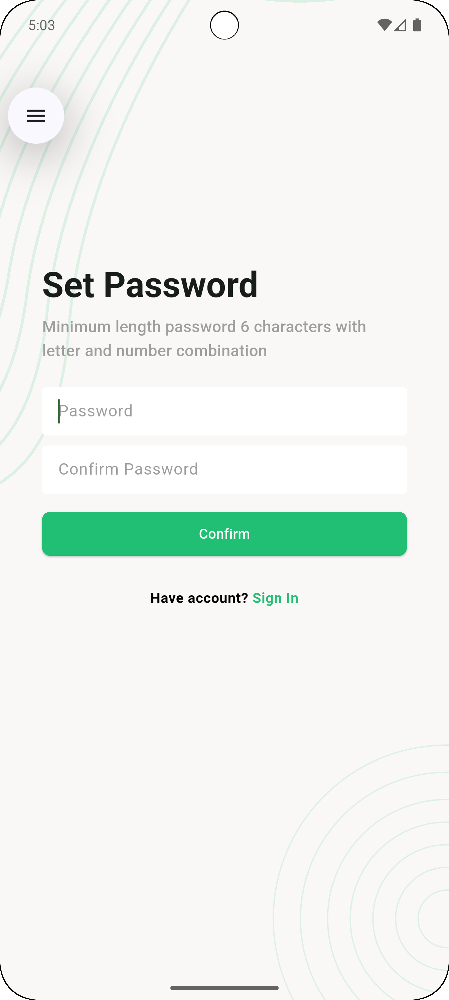<br/>
      <em>Password Setup</em>
    </td>
    <td>
      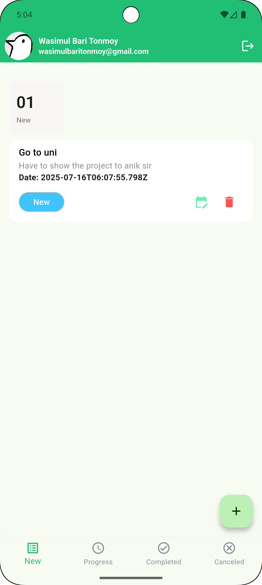<br/>
      <em>Task Dashboard</em>
    </td>
  </tr>
  <tr>
    <td>
      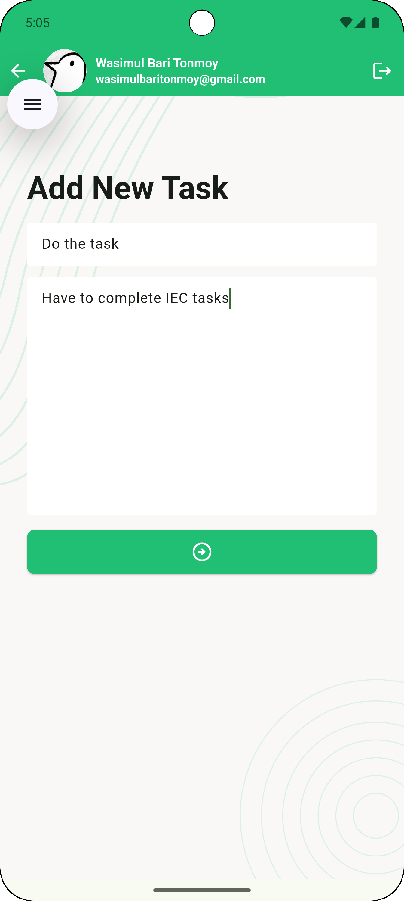<br/>
      <em>Add New Task</em>
    </td>
    <td>
      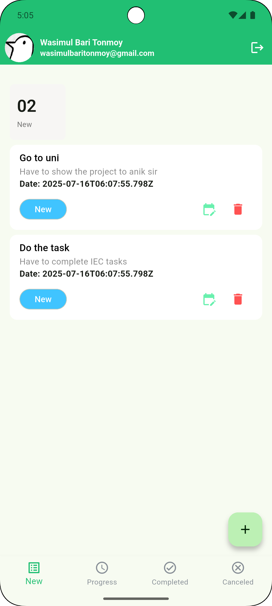<br/>
      <em>Task List View</em>
    </td>
    <td>
      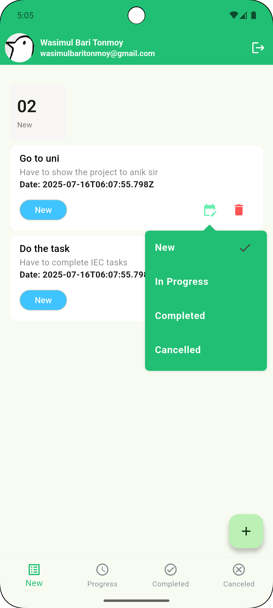<br/>
      <em>Status Options</em>
    </td>
  </tr>
  <tr>
    <td>
      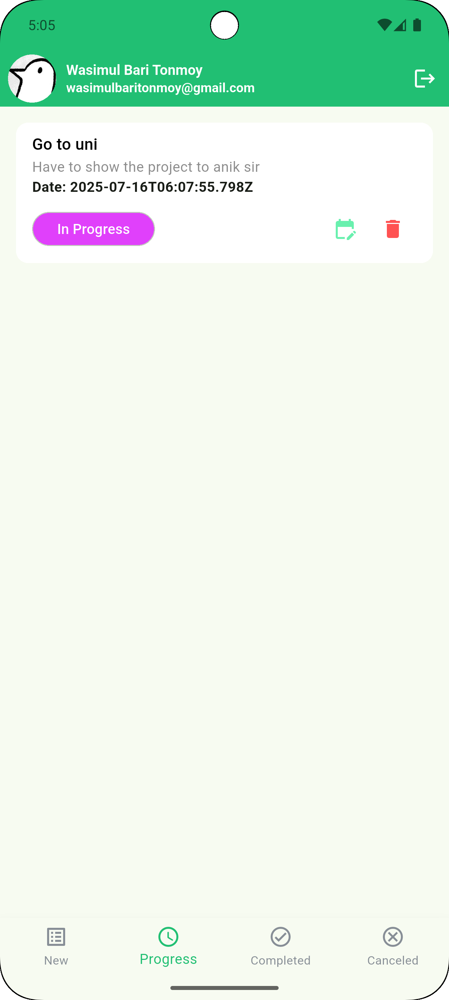<br/>
      <em>In Progress Status</em>
    </td>
    <td>
      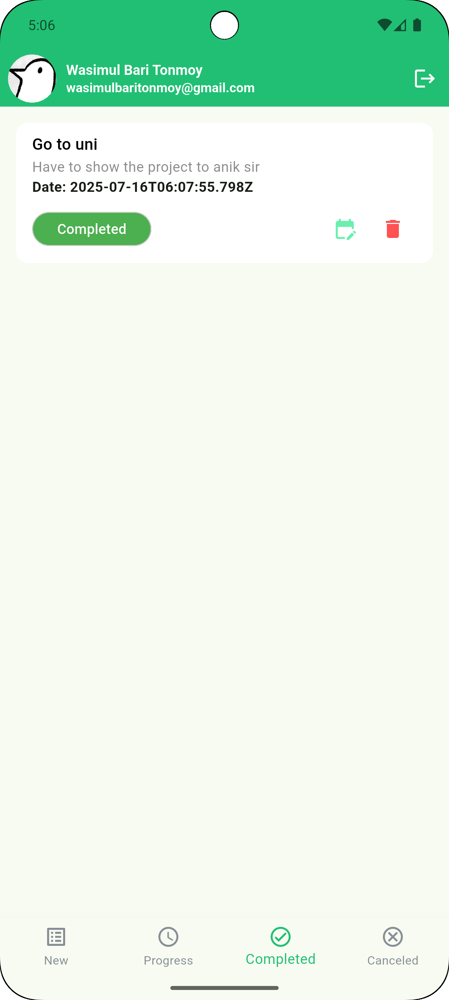<br/>
      <em>Completed Task</em>
    </td>
    <td>
      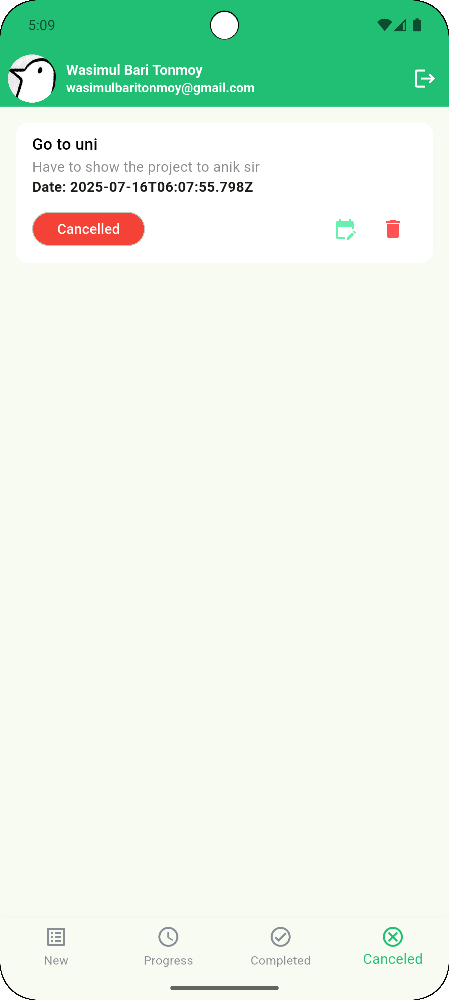<br/>
      <em>Cancelled Task</em>
    </td>
  </tr>
</table>

## ✨ Features

### 🔐 Authentication System
- **User Registration** - Complete sign-up flow with form validation
- **Secure Login** - Email/password authentication
- **Forgot Password** - Email-based password recovery
- **Email Verification** - 6-digit PIN verification system
- **Password Reset** - Secure password update functionality

### 📋 Task Management
- **Create Tasks** - Add new tasks with titles and descriptions
- **View Tasks** - Organized task dashboard with categorized views
- **Update Tasks** - Edit task details and modify content
- **Delete Tasks** - Remove unwanted tasks with confirmation
- **Status Management** - Track tasks through different states:
    - 🆕 New
    - ⏳ In Progress
    - ✅ Completed
    - ❌ Cancelled

### 🎨 User Experience
- **Modern UI Design** - Clean and intuitive interface
- **Responsive Layout** - Optimized for different screen sizes
- **Real-time Updates** - Instant task status changes
- **User-friendly Navigation** - Smooth transitions and interactions
- **Professional Styling** - Consistent color scheme and typography

## 🛠️ Tech Stack

| Technology            | Purpose                                 |
|-----------------------|-----------------------------------------|
| **Flutter**           | Cross-platform mobile app framework     |
| **Dart**              | Primary programming language            |
| **REST API**          | Backend communication and data handling |
| **POST MAN**          | To Handel api calls                     |
| **HTTP Package**      | API requests and responses              |
| **SharedPreferences** | Local data storage                      |
| **Form Validation**   | Input validation and error handling     |

## 📁 Project Structure

```
task_manager_app/
├── lib/
│   ├── main.dart                 # App entry point
│   ├── data/                     # Data-related files
│   │   ├── models/               # Data models
│   │   │   ├── task_status_count_model.dart
│   │   │   ├── task_model.dart
│   │   │   └── user_model.dart
│   │   ├── service/              # Service-related files
│   │   │   ├── network_caller.dart
│   │   │   └── urls.dart
│   ├── ui/                       # UI-related files
│   │   ├── controller/           # Controller files
│   │   │   └── auth_controller.dart
│   │   ├── screens/              # UI screens
│   │   │   ├── Forgot Password Screens/
│   │   │   │   ├── email_verification_screen.dart
│   │   │   │   ├── pin_verification_screen.dart
│   │   │   │   └── set_password_screen.dart
│   │   │   ├── add_task_screen.dart
│   │   │   ├── cancelled_task_list.dart
│   │   │   ├── completed_task_list.dart
│   │   │   ├── home_screen.dart
│   │   │   ├── new_task_screen.dart
│   │   │   ├── progress_task_screen.dart
│   │   │   ├── sign_in_screen.dart
│   │   │   ├── sign_up_screen.dart
│   │   │   ├── splash_screen.dart
│   │   │   └── update_profile_screen.dart
│   │   ├── widgets/              # Reusable widgets
│   │   │   ├── screen_background.dart
│   │   │   ├── snack_bar_message.dart
│   │   │   ├── task_app_bar.dart
│   │   │   ├── task_card.dart
│   │   │   └── task_summary_card.dart
│   ├── utils/                    # Utility files
│   │   └── assets_path.dart
├── assets/                       # Assets like images and fonts
└── pubspec.yaml                 # Dependencies
```

## 🚀 Installation & Setup

### Prerequisites
- Flutter SDK (version 3.0 or higher)
- Dart SDK
- Android Studio / VS Code
- Git

### Steps to Run

1. **Clone the Repository**
   ```bash
   git clone https://github.com/OnoPUNPUN/Task-Manager.git
   cd task_manager
   ```

2. **Install Dependencies**
   ```bash
   flutter pub get
   ```

3. **Configure API Endpoints**
   ```dart
   // lib/utils/constants.dart
   class Urls {
     static const String baseUrl = 'YOUR_API_BASE_URL';
   }
   ```

4. **Run the Application**
   ```bash
   flutter run
   ```

5. **Build for Production**
   ```bash
   # Android
   flutter build apk --release
   
   # iOS
   flutter build ios --release
   ```

## 📋 API Endpoints

| Method | Endpoint | Description |
|--------|----------|-------------|
| POST | `/Registration` | User registration |
| POST | `/Login` | User login |
| GET | `/RecoverVerifyEmail/email` | Request password reset |
| POST | `/RecoverVerifyOtp/email/867510` | Verify email PIN |
| POST | `/RecoverResetPassword` | Recover Reset Password |
| GET | `/listTaskByStatus/{taksType}` | Get all tasks |
| POST | `/createTask` | Create new task |
| PUT | `/updateTaskStatus/{taskID}/{taskType}` | Update task |
| GET | `/deleteTask/{taskId}` | Delete task |
| GET | `/taskStatusCount` | Task Status Count |

## 🔮 Future Improvements

- [ ] **Push Notifications** - Task reminders and updates
- [ ] **Dark Mode Support** - Theme switching capability
- [ ] **Task Categories** - Organize tasks by categories
- [ ] **Due Date Management** - Set and track task deadlines
- [ ] **Task Priority Levels** - High, medium, low priority system
- [ ] **Search & Filter** - Find tasks quickly
- [ ] **Data Synchronization** - Offline mode with sync
- [ ] **Task Analytics** - Productivity insights and reports
- [ ] **Collaborative Tasks** - Share tasks with team members
- [ ] **Widget Support** - Home screen task widgets

## 📚 Learning Outcomes

This project demonstrates proficiency in:
- **Flutter Development** - Building cross-platform mobile apps
- **State Management** - Effective app state handling
- **API Integration** - RESTful web services consumption
- **Authentication Flow** - Secure user management
- **Database Operations** - CRUD operations implementation
- **UI/UX Design** - Creating intuitive user interfaces
- **Form Validation** - Input validation and error handling
- **Navigation** - Multi-screen app navigation

## 🙏 Acknowledgments

This project was developed as part of the **Ostad Assignment Project** - a comprehensive full-stack development practice initiative. Special thanks to:

- **Ostad Platform** for providing the project requirements and learning framework
- **Flutter Community** for excellent documentation and resources
- **Course Instructors** for guidance throughout the development process

The project serves as a practical demonstration of real-world mobile app development skills and full-stack integration capabilities.

---

<div align="center">
  <strong>⭐ If you found this project helpful, please give it a star! ⭐</strong>
  <br/><br/>
  Made with ❤️ using Flutter | © 2025 Task Manager App
</div>